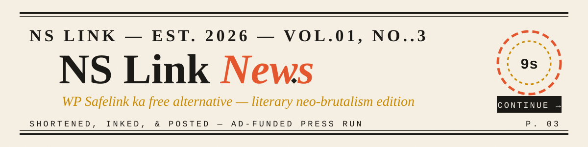
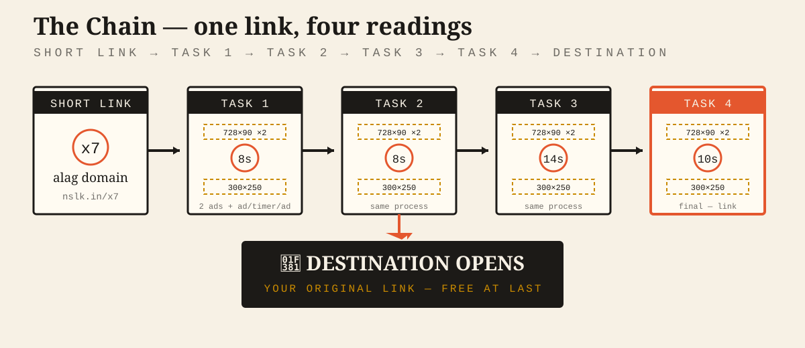
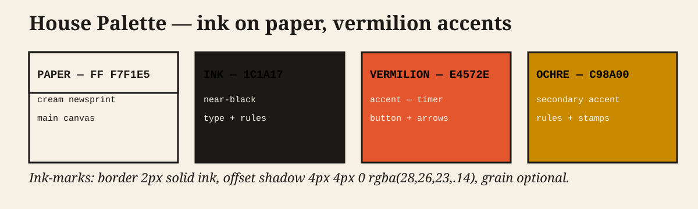
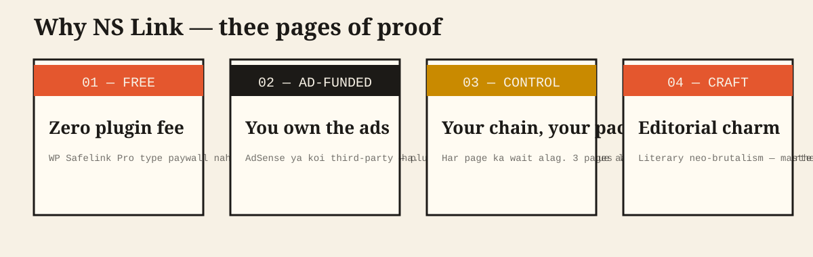
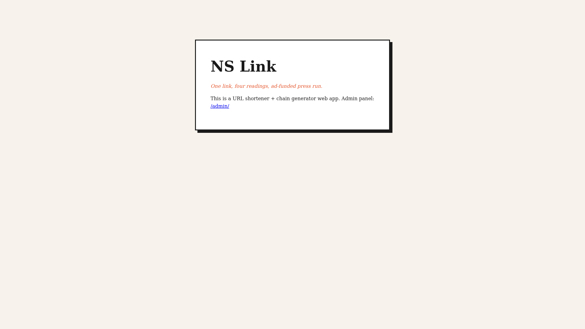
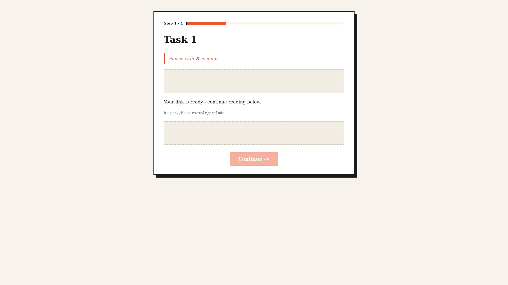
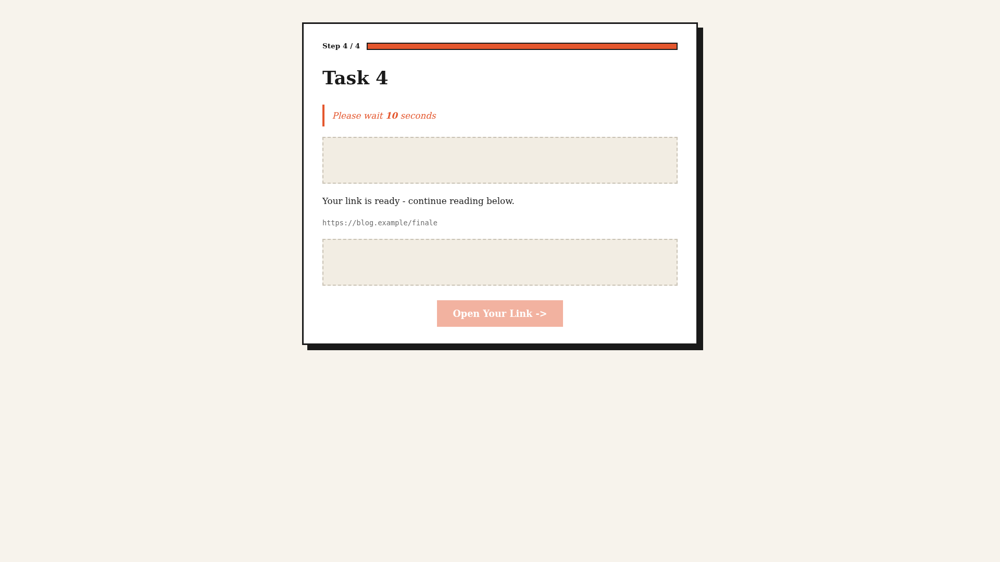
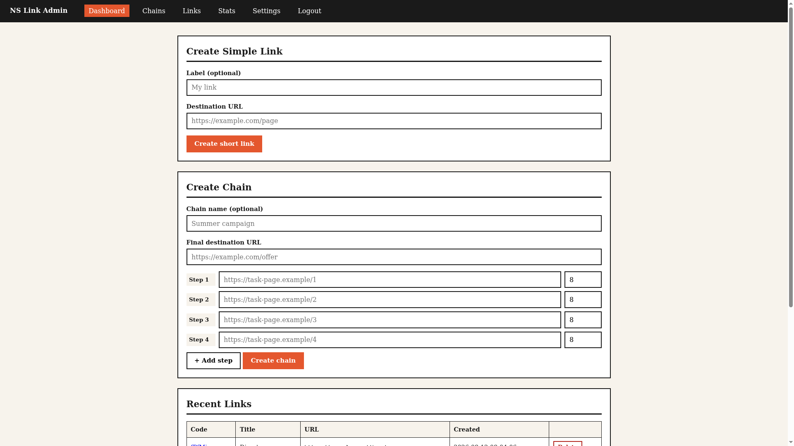
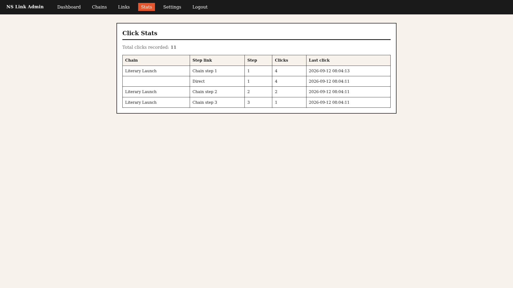

<p align="center">
  
</p>

<p align="center"><b>A FREE alternative to WP Safelink</b> — literary neo-brutalism / editorial design. <em>One link, four readings, ad-funded press run.</em></p>

<p align="center">
  <a href="https://github.com/NSKWeb/ns"></a>
  &nbsp;
  <a href="shortener/README.md"></a>
  &nbsp;
  <a href="https://work-2-axtomacioldgqets.prod-runtime.all-hands.dev/"></a>
</p>

> 🌐 **Language / भाषा:** English (this page) · [**हिंग्लिश (Hinglish)**](README.md)

---

## What NS Link is

NS Link is a **two-part, self-hosted ad-monetization kit**:

1. **Part 1 — WordPress plugin** (`ns-link-wp/`): a "safelink" **control layer** for your task pages.
2. **Part 2 — URL shortener web app** (`shortener/`): a **vanilla PHP + SQLite** shortener + chain generator with a single-admin panel.

Both share the same editorial *literary neo-brutalism* design language. Everything is **GPL-2.0-or-later, 100% free**, no account, no backend vendor.

<div align="center">

| | |
|---|---|
| 🕰️ | **Control layer** — timer ring, "Scroll Down to Continue", Continue / Open-Your-Link button |
| 🧩 | **Ad-slot containers** — empty divs, you fill them from WP/cPanel |
| 📰 | **Editorial design** — masthead branding, grain, reg-marks — literary neo-brutalism |
| 💰 | **100% FREE, GPL, no backend** |

</div>

<p align="center">
  
</p>

---

## Repository structure — press room

| Path | What it is |
|---|---|
| `ns-link-wp/` | **WordPress plugin (Part 1)** — control layer + settings |
| `shortener/` | **🧷 URL shortener web app (Part 2)** — PHP + SQLite, chain generator + single admin panel (links / chains / stats / settings). Flow diagram: [`ns-link-shortener-flow.svg`](assets/brand/ns-link-shortener-flow.svg). Docs: [`shortener/README.md`](shortener/README.md) |
| `assets/brand/` | SVG brand assets — masthead, Part-1 flow, **Part-2 shortener flow**, palette, badges |
| `assets/screenshots/` | **Live-demo screenshots** (landing, task page, final step, admin dashboard, stats) |
| `preview-ns-link.html` | Full editorial article page (design reference) |
| `preview-ns-link-simple.html` | Control layer only, no article |
| `preview-ns-link-flow.html` | Side-by-side flow template (P1–3 vs P4) |
| `test-ns-link-layer.html` | **Live test harness** — timer runs |
| `README.md` | Hinglish (हिंग्लिश) quick start + deployment guide |
| `README.en.md` | This page — English |

---

## House style — palette

<p align="center">
  
</p>

---

## Plugin — quick start

```
1. Copy the folder to /wp-content/plugins/ (or upload the plugin zip)
2. Activate "NS Link - Control Layer"
3. Settings > NS Link > set the defaults
4. Create the pages (task-1 ... task-4) and open them with the chain URL pattern:
```

```text
https://site.com/task-1/?step=1&total=4&wait=8&next=<task-2 URL>
https://site.com/task-2/?step=2&total=4&wait=8&next=<task-3 URL>
https://site.com/task-3/?step=3&total=4&wait=14&next=<task-4 URL>
https://site.com/task-4/?step=4&total=4&wait=10&done=1&dest=<destination URL>
```

> Ad slots are the plugin's **empty divs** (`.nslink-ad-top`, `.nslink-ad-mid`, `.nslink-ad-foot`) — put ad codes in them from WordPress (Ad Inserter / Gutenberg) or cPanel. Details: [`ns-link-wp/README.md`](ns-link-wp/README.md).

---

## Why NS Link

<p align="center">
  
</p>

---

## Deployment Guide — step by step

### Step 0 — Download / clone the repo

**Option A — ZIP download (no git needed):**
1. Open the repo: https://github.com/NSKWeb/ns
2. Green **Code** button → **Download ZIP** → extract.

**Option B — Git clone (recommended):**
```bash
git clone https://github.com/NSKWeb/ns.git
cd ns
```

### Step 1 — Install the plugin on WordPress

1. Zip the inner `ns-link-wp` folder:
   ```bash
   zip -r ns-link-wp.zip ns-link-wp/
   ```
2. WordPress admin → **Plugins → Add New → Upload Plugin**.
3. Pick `ns-link-wp.zip` → **Install Now** → **Activate**.
4. OR via cPanel: upload the `ns-link-wp` folder to `public_html/wp-content/plugins/` → WP admin → Plugins → **Activate**.

> Keep the folder name `ns-link-wp` (the zip root folder must be that name; WP depends on it).

### Step 2 — Configure the plugin

1. WP admin → **Settings → NS Link**.
2. Set the defaults:
   - **Default timer** — 8 seconds (or your choice)
   - **Line — pages 1–3** — `Scroll Down to Continue`
   - **Line — final page** — `Continue to Link`
   - **Button — continue** — `Continue ->`
   - **Button — final** — `Open Your Link ->`
   - **Theme mode** — `Custom (Literary Neo-Brutalism)` (or `Auto` to blend with your WP theme colors)
   - Keep the other toggles ON (ad slots, sticky bar, auto-scroll, progress rule).
3. **Save Changes**.

### Step 3 — Create your 4 ad pages (WordPress)

1. WP admin → **Pages → Add New** → create `task-1` (article content + images).
2. Put **ad codes** on the article page:
   - **Ad Inserter** plugin (free) to control each ad position, or
   - **Custom HTML** block in Gutenberg, or
   - **cPanel** server-side header/footer injection.
3. Create `task-2`, `task-3`, `task-4` the same way.

> You can also put ad codes inside the plugin's **empty ad-slot containers** — class names: `.nslink-ad-top`, `.nslink-ad-mid`, `.nslink-ad-foot`. Put the ad code inside the container and make the container visible.

### Step 4 — Build & test the chain URLs

Chain URL pattern (see the example at the top):
```bash
# Page 1
https://site.com/task-1/?step=1&total=4&wait=8&next=https%3A%2F%2Fsite.com%2Ftask-2%2F%3Fstep%3D2%26total%3D4%26wait%3D8%26next%3D...
# Pages 2, 3 — same pattern, step+=1
# Page 4 (final)
https://site.com/task-4/?step=4&total=4&wait=10&done=1&dest=https%3A%2F%2Fdestination-link.com%2Foffer
```

> The `next` and `dest` URLs must be **URL-encoded** (if they contain their own `?` params — `%3F` = `?`, `%26` = `&`, `%2F` = `/`). Use any URL encoder, or Python: `python3 -c "import urllib.parse; print(urllib.parse.quote('https://...', safe=''))"`.

1. First open **only page 1** — you should see the control layer (timer running, ad slots, "Scroll Down to Continue"). When the timer ends, the sticky Continue button activates.
2. Test the chain URLs, or add `?skip=1` to make the timer 1 second for fast testing.
3. On the final page, click **Open Your Link ->** → the destination should open.

### Step 5 — View it live (preview files)

Preview/design files are in this repo — open them directly in a browser, or put them on any free static host:
```bash
# Local test
cd ns
python3 -m http.server 8080
# -> http://localhost:8080/test-ns-link-layer.html
```
Free hosting (Netlify Drop / Vercel / GitHub Pages): drag-and-drop the repo root folder → get a live link → view `preview-ns-link-flow.html`, etc.

### Step 6 — Deploy Part 2 (URL shortener web app)

**Part 2 lives in the `shortener/` folder** — a self-contained **PHP + SQLite URL shortener + chain generator**. Full docs + **step-by-step deploy/host/operate guide**: [`shortener/README.md`](shortener/README.md) (English) / [`shortener/README.hi.md`](shortener/README.hi.md) (हिंग्लिश). License: **GPL-2.0-or-later** (`shortener/LICENSE`).

#### 🧪 Live demo (container preview)

> The demo runs on a temporary all-hands container URL — it may not always be up. Admin login: `admin` / `ns-admin-2026` *(change it soon)*. Fresh DB, reset-friendly.

| What | Link |
|---|---|
| **App root (primary)** | [work-2 … all-hands.dev](https://work-2-axtomacioldgqets.prod-runtime.all-hands.dev/) |
| **App root (backup)** | [work-1 … all-hands.dev](https://work-1-axtomacioldgqets.prod-runtime.all-hands.dev/) |
| **Chain flow** | [chain `qTqvVFAZ`](https://work-2-axtomacioldgqets.prod-runtime.all-hands.dev/go/qTqvVFAZ) — 4 timed task steps → "Open Your Link" |
| **Direct link** | [direct `fPfMju`](https://work-2-axtomacioldgqets.prod-runtime.all-hands.dev/go/fPfMju) — 302 to example.com |
| **Admin panel** | [login](https://work-2-axtomacioldgqets.prod-runtime.all-hands.dev/admin/login.php) |

<details open>
<summary>📸 Screenshots (live app) — open by default</summary>

| Landing | Task page | Final step | Dashboard | Stats |
|---|---|---|---|---|
|  |  |  |  |  |

</details>

<p align="center">
  
</p>

**What it does (one line):** `site.com/go/abc123` → the visitor stops on task pages (ad slots) → timer ends → **Continue** → on the final step **Open Your Link** → destination. Every step's click is logged.

**Logic — the `/go/<code>` flow:**

| Step | What happens |
|---|---|
| 1. Plain link? | a direct URL found in the `links` table → click logged → **302 redirect** to the target |
| 2. Chain-step link? | the URL contains `chain=<c>&step=<n>` → click logged → **task page render** (timed) |
| 3. Chain code? | a chain found in the `chains` table → click logged → **302 redirect** to the first step's short link |
| 4. Nothing | **404 Not Found** |

**Deploy path** (InfinityFree / 000webhost / any PHP host):
```bash
1. Upload the `shortener/` folder to the host's `htdocs/`
2. Point the domain -> `site.com/go/<short-code>` runs the chain flow
3. Admin panel `site.com/admin/` lets you set links + chains + timer + destination
4. Right after logging in, change the default password (Settings)
```

**Local test** — PHP built-in server (no install):
```bash
cd shortener
php -S 127.0.0.1:8099 router.php
# -> http://127.0.0.1:8099/   (admin: /admin/login.php)
```

> **Smart tables** — `links` (redirects), `chains` (steps JSON), `clicks` (per-step hits). Single-file SQLite, auto-schema, prepared statements. 22/22 smoke tests pass.

### Step 7 — Push changes to GitHub (later)

```bash
cd ns
git add -A
git commit -m "update"
git push origin main
```
(You need write access — token or SSH.)

---

## Next steps

- **Part 2** ✅ — **URL shortener web app / website** (chain generator + admin panel) — ready in the `shortener/` folder. Docs: [`shortener/README.md`](shortener/README.md)
- **Part 3** ⏳ — Free hosting deploy via GitHub Actions (optional)

---

## License

**NS Link** is [GPL-2.0-or-later](LICENSE). 📜

| | |
|---|---|
| **License** | GNU General Public License **v2.0 or later** (GPL-2.0-or-later) |
| **File** | [`LICENSE`](LICENSE) — official GNU text (canonical copy from gnu.org) |
| **What you can do** | ✓ Use, copy, modify, distribute, sell freely ✓ |
| **What you cannot do** | ✗ Don't take away others' rights (your derivative must stay GPL) ✗ |
| **If you distribute** | Provide the source code + keep the GPL license + copyright notice |
| **Applies to — every part of the repo** | Plugin (`ns-link-wp/`), web app (`shortener/`), design assets (`assets/`), previews, docs — all under this license |
| **No warranty** | This software is "AS IS" — no warranty, no liability (Sections 11, 12) |
| **Compatibility** | GPL-v2-or-later is compatible with GPL-v2-or-later and (via the "or later" clause) GPL-v3 projects |

**Proper attribution + license notice:**

If you use or distribute NS Link:

1. **Keep the copyright + license notice** — in the source files (already in the `ns-link.php` header: `License: GPL-2.0-or-later`).
2. **Ship the LICENSE file** with it — or link to this repo's LICENSE.
3. **Offer the source code** — if you distribute a modified/binary version, the **source code** must remain available under the same GPL license.
4. **"AS IS"** — don't claim any guarantee; the software is free, so it carries no warranty.

| Author | NSKWeb |
|---|---|
| Copyright | © 2026 NSKWeb |
| License | [GPL-2.0-or-later](LICENSE) |
